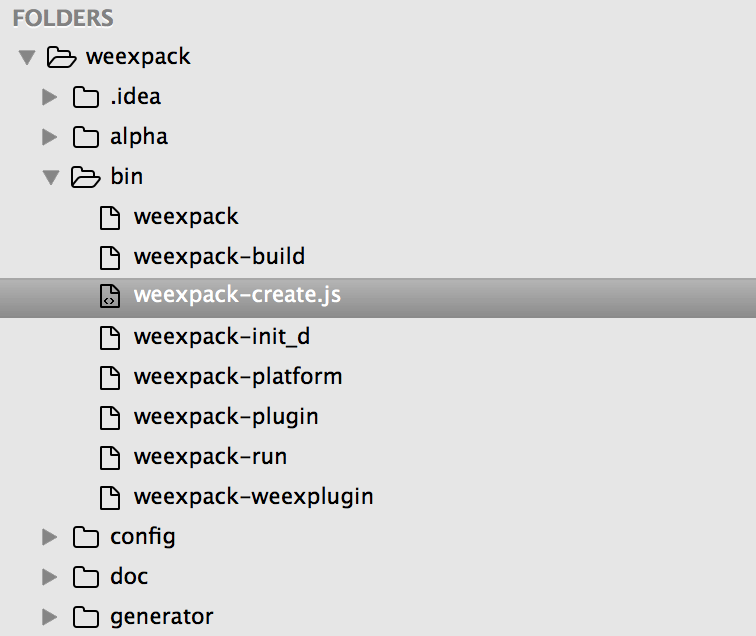

Weex 源码分析学习（一） —— create 命令的实现

根据 **weex-toolkit（1.0.5）** 中 `bin/weex` 文件可知 create 命令主要通过 weexpack 中的 create 命令实现

## weexpack（0.4.0）

该模块主要用来打包 JSBundle ，实际也是对 Webpack 的封装

### package.json

通过 package.json 可知该模块入口为 bin/weexpack

```javascript
  "bin": {
    "weexpack": "./bin/weexpack"
  },
```

### bin/weexpack

```javascript
#!/usr/bin/env node

const program = require('commander')
const chalk = require('chalk')
const market = require('../src/publish/market');
const cli = require('../src/cli')
program
  .version(require('../package').version)
  .usage('<command> [options]')
  // .command('init [name]', 'initialize a standard weex project')
  .command('create [name]', 'initialize a standard weex project')
  .command('platform [command]', 'command for add or remove a  platform project')
  .command('run [platform]', 'run weex app on the specific platform')
  .command('build [platform]', 'build weex app generator package(apk or ipa)')
  .command('plugin [command]', 'command for add or create and publish weex plugins')
  .command('weexplugin [command]', 'create a project that is a manager of plugin')

program.parse(process.argv)

if (program.args.length < 1) {
  program.help();
  process.exit();
}

if(program.args.length >= 1){
  var isSupport = false;
  var list = ["create", "platform","run", "build", "plugin", "weexplugin"]
  for(var i =0;i<list.length;i++){
    if(program.args[0] == list[i]){
      isSupport = true;
      break;
    }
  }
  if(!isSupport){
    console.log("  error: unknown command '"+ program.args[0]+ "'")
    process.exit();
  }

}
```

*bin/weexpack* 主要完成 weexpack 命令解析与校验，其中 create 命令通过 weexpack-create.js 文件完成（为啥这个命令要 js 结尾？）



### bin/weexpack-create.js

```javascript
#!/usr/bin/env node

const program = require('commander');
const chalk = require('chalk');
const create = require('../src/create/create');
const cli = require('../src/cli');
const publish = require('../src/publish/publish');

program.usage('[project-name] [options]').on('--help', () => {
  console.log('  Examples:\n');
  console.log(chalk.grey('    # create a standard weex project'));
  console.log('    $ ' + chalk.blue('weexpack create myProject'));
  console.log();
}).parse(process.argv)


let args=[];
process.argv.forEach(function(arg,i){
  if(arg!='[object Object]') {//fix commander’s bug
    args.push(arg);
    if (i == 1) {
      args.push('create');
    }
  }
});

const projectName = args[3]

if (!projectName || !projectName.match(/^[$A-Z_][0-9A-Z_-]*$/i)) {
  var msg = chalk.red('Invalid project name: ') + chalk.yellow(projectName);
  console.log(msg);
  process.exit();
}

cli(args);


if (program.args.length < 1) {
  program.help();
  process.exit();
}
```


